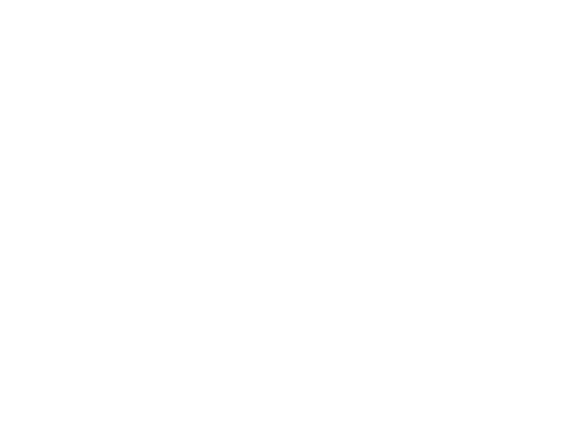

# RadioMuos

Internet radio app for muOS handhelds, tested on the Anbernic RG35XX H.

RadioMuos is a lightweight SDL2 frontend for streaming radio stations through
`mpv`, with a real-time `ffmpeg` visualizer and Radio Browser search.



## Features

- Built-in SomaFM and public radio station list.
- Radio Browser search by name, tag, country, recent searches, and top stations.
- Favorites and recently played history persisted on device.
- Stream metadata display when the station exposes ICY metadata.
- Full-width audio visualizer with neon bars, spectrum, and waveform modes.
- Sleep timer and volume controls.
- No Python package dependencies; uses Python stdlib plus system SDL2/mpv/ffmpeg.

## Install

Copy the app folder to your muOS SD card:

```text
application/RadioMuos -> /MUOS/application/RadioMuos
```

Then open `RadioMuos` from the muOS Applications menu.

GitHub release ZIPs contain the same `application/RadioMuos` folder layout, so
they can be extracted directly to the root of the muOS SD card.

## Controls

| Button | Action |
| --- | --- |
| D-pad | Move selection / switch tabs |
| A | Play selected station |
| B | Stop playback |
| Y | Toggle favorite |
| X | Cycle sleep timer |
| L1 / R1 | Previous / next tab |
| R2 | Search / browse menu |
| L2 / Volume Down | Volume down |
| Select / Volume Up | Volume up |
| L3 | Toggle visualizer |
| R3 | Cycle visualizer mode |
| Start | Quit |

## Runtime Files

RadioMuos creates `state.json` next to the app files to store volume,
favorites, history, recent searches, Radio Browser cache, and visualizer state.
This file is intentionally ignored by git.

## Notes

- The visualizer uses a separate `ffmpeg` process reading the same stream as
  `mpv`. The default neon bars mode reads low-rate PCM and draws clean colorful
  bars in Python; spectrum/waves modes use ffmpeg video filters. HLS streams are
  read with `-re` to avoid bursty frame updates.
- Radio Browser lists are cached for one day so tag/country browsing still
  opens quickly after the first load.
- If a stream ends or fails, the now-playing panel reports the mpv event instead
  of staying stuck on buffering.
